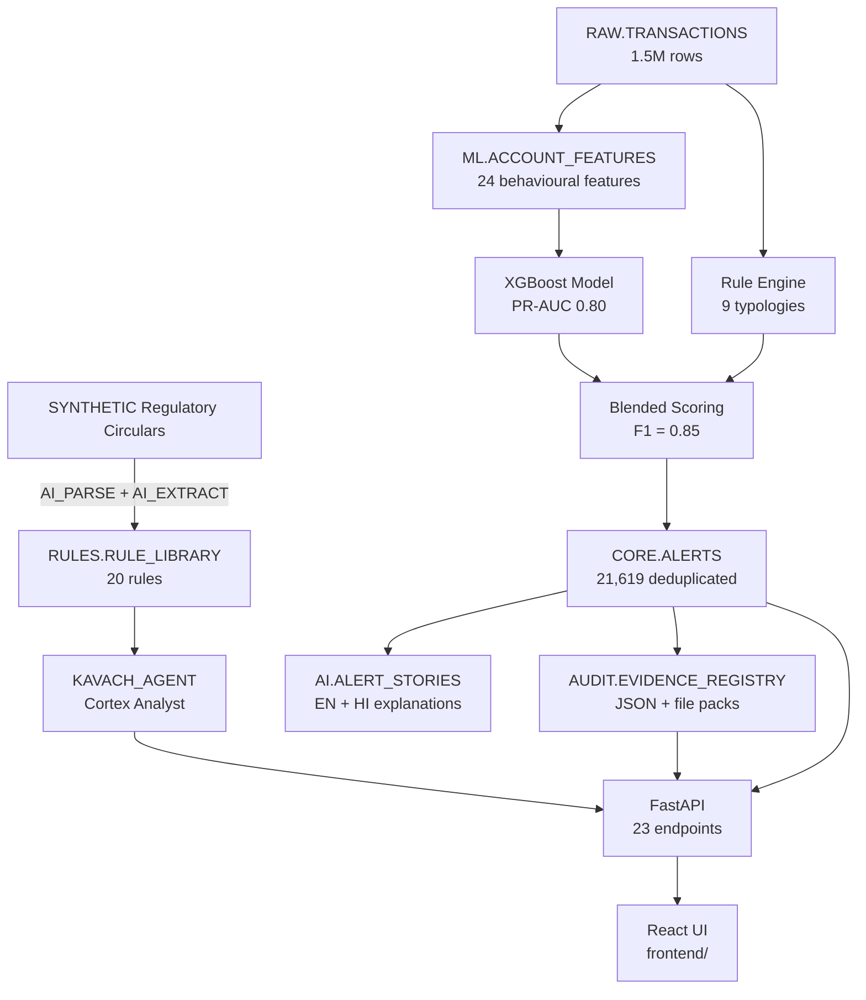

# KAVACH — Risk, Fraud & Regulatory Intelligence Copilot

**A Snowflake-native AI system for Indian bank compliance teams**

🛡️ Turns regulatory circulars into executable fraud checks  
🤖 Explains every alert in plain English + Hindi  
📊 Generates audit-ready evidence packs  
🎯 Detects mule rings, round-tripping, structuring, and 6 more typologies

---

## Quick Links

- **[FINAL_REPORT.md](FINAL_REPORT.md)** — ⭐ Start here: completion status, what works, next steps
- **[PROJECT_BRIEF.md](PROJECT_BRIEF.md)** — Original requirements & scoring rubric
- **[docs/EVALUATION.md](docs/EVALUATION.md)** — Phase 4-5 metrics (F1=0.85, PR-AUC=0.80)
- **[docs/BLOCKERS.md](docs/BLOCKERS.md)** — Design decisions & token budget tradeoffs
- **[docs/PROGRESS.md](docs/PROGRESS.md)** — Build log, checkpoint by checkpoint (backend Session A, frontend Session B)
- **[docs/DESIGN_SPEC.md](docs/DESIGN_SPEC.md)** — Frontend look, feel, copy and layout (source of truth)
- **[docs/API_EXTENSIONS.md](docs/API_EXTENSIONS.md)** — Additive API fields/endpoints the frontend needs, plus data-quality issues to fix before the demo

---

## What's Complete ✅

### Phases 1-5: Fully Functional (100%)
1. **Foundation** — KAVACH_DB with 7 schemas, 4 roles, masking policies
2. **Synthetic Data** — 1.5M transactions, 28K accounts, 9 fraud typologies injected
3. **Regulation Compiler** — AI parsed 8 SYNTHETIC circulars → 20 executable rules
4. **Detection Engine**:
   - XGBoost model (PR-AUC 0.7968)
   - Rule engine (100% recall on 8/9 typologies)
   - Blended scoring (Precision 0.92, Recall 0.79, F1 0.85 @ budget=50)
   - Mule ring detection (140 rings, 100% planted accounts found)
   - Round-trip cycle detection (5 cycles, 81.5% coverage)
5. **Conversational Intel**:
   - Semantic view with 25 verified queries
   - Cortex Agent (KAVACH_AGENT)
   - Cortex Search over regulatory text
   - Evaluation: 25 test questions

### Phase 6: Explainability (70%)
✅ **Created in Snowflake**:
- `AI.ALERT_STORIES` table
- `AI.GENERATE_ALERT_STORIES()` procedure (batched EN + HI story generation)
- `AI.EXPLAIN_ALERT(alert_id, lang)` function
- `AI.BUILD_EVIDENCE_PACK(alert_id)` procedure
- `AI.DRAFT_STR(alert_id)` function (generates draft Suspicious Transaction Report)
- `AI.DEADLINE_CLOCK` view (RED/AMBER/GREEN status)
- `AI.RULE_HEALTH` view (per-rule precision)
- `AI.READINESS_SCORE` view (0-100 compliance metric)
- `AUDIT.EVIDENCE_REGISTRY` table

⚠️ **Not Tested**: Procedures created but not executed to preserve credit budget

❌ **Not Implemented**: PDF generation, SHA-256 tamper verification, TIME_MACHINE threshold tuning

---

## What's Incomplete ⚠️

### Phases 7-8: Application layer (in progress)
- **Backend** (FastAPI, N-layered): 23 endpoints implemented and smoke-tested against live Snowflake (23/23 pass; see `docs/PROGRESS.md` checkpoints 2–4). `/api/ask` calls the Cortex Agent and streams normalized SSE.
- **Frontend** (React 18 + Vite + TypeScript, `frontend/`): being built in steps (see "Frontend" below and `docs/PROGRESS.md`, Session B). It runs fully on mock data while the Snowflake account is offline.
- **SPCS Deploy**: Guide in `deploy/README.md`, not executed yet.
- **Skills & Tasks**: 4 skills created, Task DAG not created.
- **Ops Console**: Minimal Streamlit app in `ops_console/app.py` ✅

> **Known data issues before the demo** (details in `docs/API_EXTENSIONS.md`):
> - The LLM alert stories carry a preamble, and 7 of them are refusals.
> - The rule approvals were left behind by the smoke test.
> - `ML.EVAL_REPORT` shows precision 0.80 / recall 0.58 / F1 0.67 for all three methods, which conflicts with the F1 0.85 quoted above. Needs a re-check.

---

## Architecture



---

## Frontend

React 18 + Vite + TypeScript (strict), Tailwind 4 design tokens (light + dark), Radix primitives, framer-motion, Recharts, React Flow, TanStack Query, react-i18next (English + हिन्दी) and MSW mocks. Look, copy and layout follow `docs/DESIGN_SPEC.md`.

```bash
cd frontend
npm install
npm run dev:mock      # everything served by mock data (no backend needed)
npm run dev           # talks to FastAPI on :8080 through the Vite proxy
npm run build         # type-check + production build into frontend/dist
npm run e2e           # Playwright tests (mock mode)
npm run screens       # visual QA screenshots → docs/screens/
npm run gen:fixtures  # rebuild mock data from data/exports/tables
npm run gen:api       # regenerate API types from docs/openapi.json
```

| Setting | Meaning |
|---|---|
| `VITE_USE_MOCKS=true` | Serve every endpoint from MSW. A "Demo data" chip shows in the top bar. |
| `VITE_API_BASE` | Backend origin when it isn't same-origin (default: same origin, `/api` proxied to `:8080` in dev). |
| `?role=reviewer\|analyst\|admin` | Mock mode only: sign in as that role. The reviewer sees a read-only banner and masked names. |
| `?cold=1` | Mock mode only: simulate a sleeping server, which shows the "Waking up the secure server…" screen. |

**Layers:** `pages → features → shared`. `src/services/api` is the only code that calls the backend:
- `generated/schema.ts` holds the types generated from `docs/openapi.json`.
- `dto.ts` is the wire contract, with proposed extensions marked `EXT`.
- `adapters.ts` turns backend responses into screen-ready view models.
- `queries.ts` holds the TanStack Query hooks.

**Mock data** (`src/mocks/`) is generated from the real exports:
- the 200 alert stories, cleaned (EN + HI);
- the 49 circular paragraphs;
- the 21 rules, 9 conflicts and the evaluation numbers;
- synthetic customers, transactions, timelines and 12 mule rings, with IDs that link across every endpoint.

**Shortcuts:** `G T` Today · `G A` Alerts · `G K` Ask · `G R` Rings · `G B` Rulebook · `G M` Time Machine · `/` search · `P` presentation mode · `?` shortcuts.

